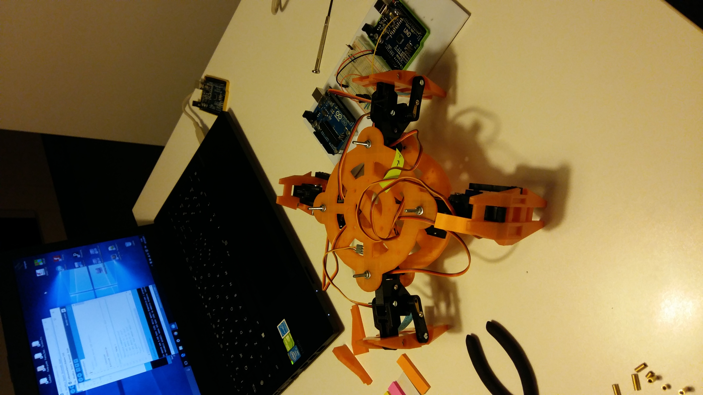
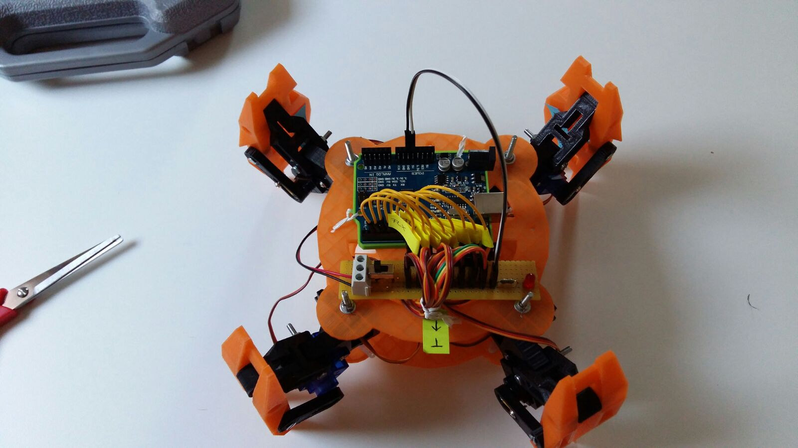
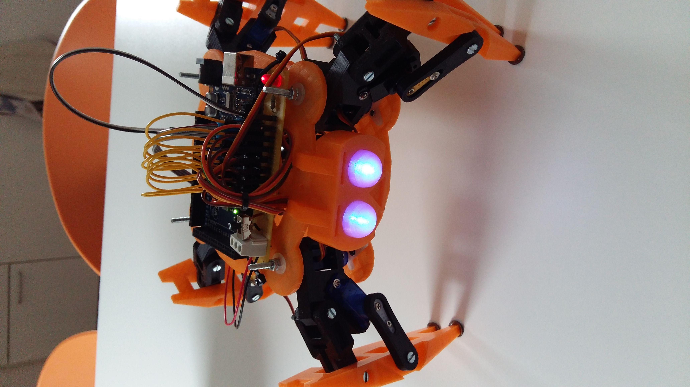
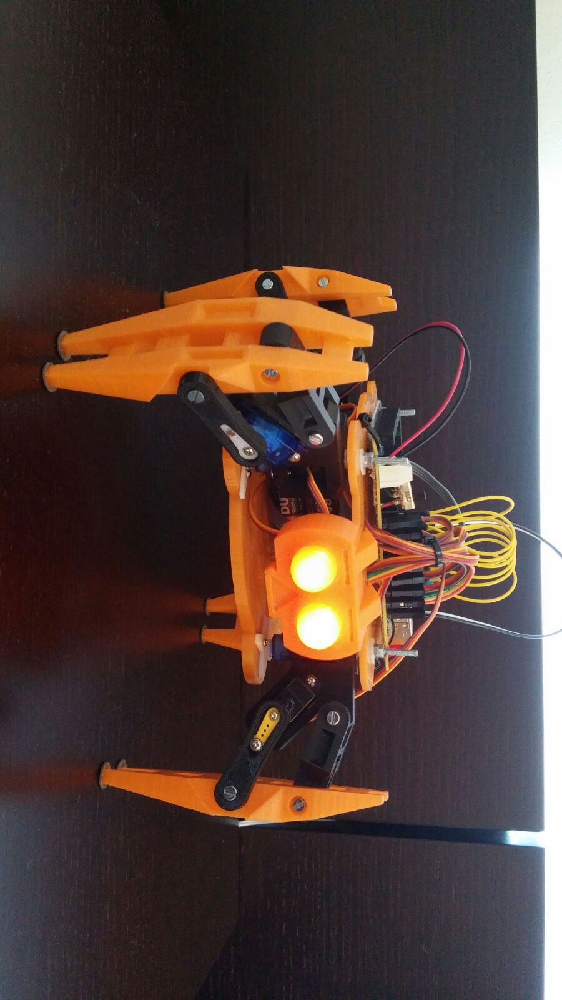
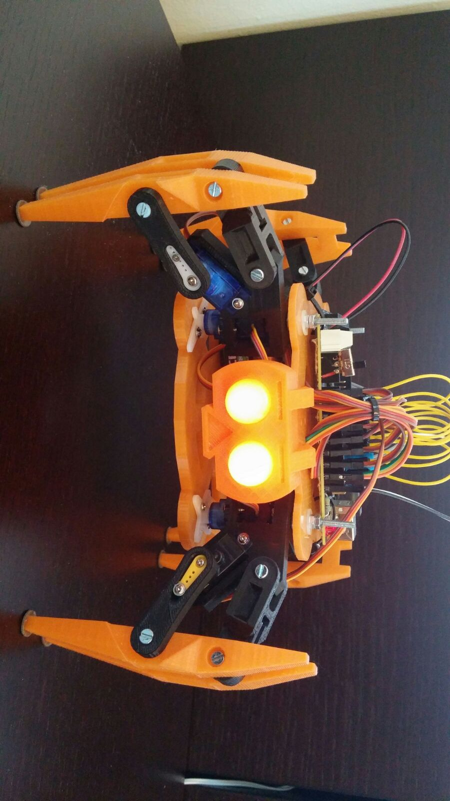

# Turtlebot - quadruped robot

### Project:
3D printed Quadruped robot, controlled by Arduino board, based on the phisical design [www.thingiverse.com/thing:152638](https://www.thingiverse.com/thing:152638)

---

  Copyright &copy; 2015 Filippo Petri, Mattia Dal Ben

___ 

     First test    
     Testing    
     Final testing    
     Turtlebot finished 1   
     Turtlebot finished 2

